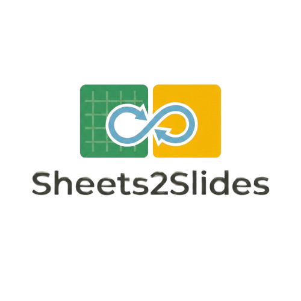
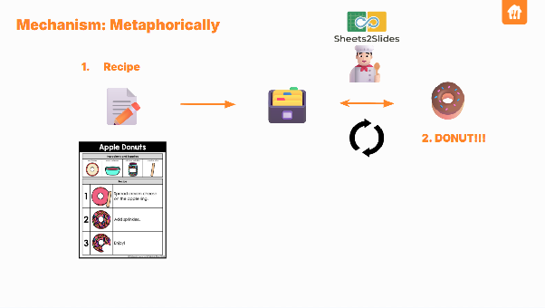
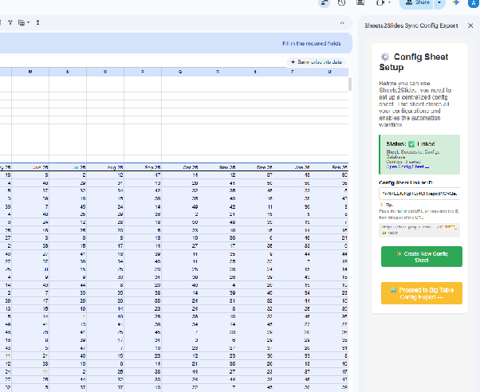
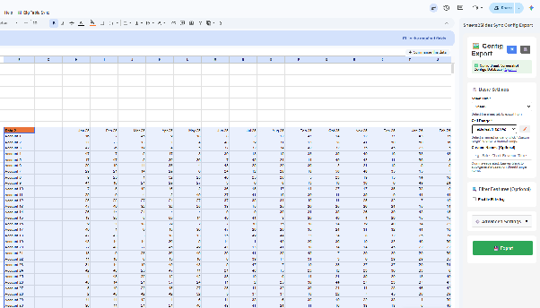
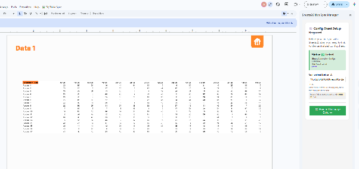
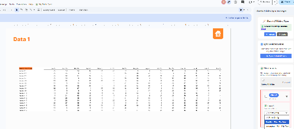
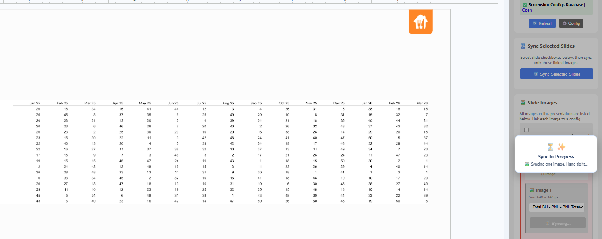

# Sheets2Slides

Sheets2Slides keeps Google Slides visuals synced with live ranges from Google Sheets.

Instead of re-exporting screenshots, re-uploading images, and manually replacing charts or tables in a deck, you define a config once in Sheets and then re-sync linked images from Slides whenever the source data changes.

## What Problem It Solves

Teams often build presentations from spreadsheet-driven tables, KPI snapshots, forecasts, or reporting views.

The usual workflow is painful:

1. Build a range in Google Sheets.
2. Export or screenshot it.
3. Insert it into Google Slides.
4. Repeat the whole process every time the data changes.

Sheets2Slides solves that by separating the workflow into two parts:

1. A Google Sheets addon that exports reusable sync configs.
2. A Google Slides addon that links slide images to those configs and refreshes them on demand.

## Demo


The demo shows the Slides sidebar listing linked slide images and syncing them back to spreadsheet-backed configs.

## How To Use

Metaphorically, using this extension is like creating a recipe and giving it to your personal chef to recreate your favorite food without having to do all the boring (cooking) stuff!!

📝The Recipe: Your raw data in Google Sheets.
👨‍🍳The Chef: Our Sheets2Slides tool.
🍩The Food: Your finished and updated Google Slides

## 📝Step 1: Exporting Recipe (Google Sheets)

1. Go to Google Sheets and navigate to Extensions -> Sheets2Slides -> Configure & Export.
2. The sidebar UI will pop up. If it's your first time, please create a new config sheet. But, If you already have a config sheet from your team, just copy the link of that config sheet instead.



3. Select the data range that you want to create as a recipe. You can do this by selecting the named range or the active range from your Google Sheets.



4. Press Export!

## 👨‍🍳Step 2: Telling your chef to recreate that recipe (Google slides)

1. Open your Google Slides and navigate to Extensions -> Sheets2Slides -> Open Sync Panel.
2. The sidebar UI will show up; enter the config sheet link that you just created.



3. Select the image from the slides you want to link with the recipe. Your exported recipe from the first step should automatically appear here.



4. If you are ready, just press Sync and let Sheets2Slides do the work!!



5. Done!

## Repository Layout

- `Gsheets addons/exportconfig.gs`: Sheets addon backend
- `Gsheets addons/exportconfigfront.html`: Sheets addon sidebar UI
- `Gslides addons/imagesync.gs`: Slides addon backend
- `Gslides addons/imagesyncsidebar.html`: Slides addon sidebar UI
- `pub-sub/main.py`: optional GCP conversion worker
- `pub-sub/Dockerfile`:iner image for the worker

## Installation Overview

There are two supported conversion setups:

1. `CloudConvert`: easiest to get running
2. `GCP Pub/Sub + Cloud Run + GCS`: cheapest and most controlled long-term setup

Both addons share conversion settings through the linked config spreadsheet. The addons automatically maintain a `Settings` tab in that spreadsheet.

## Install The Google Apps Script Addons

This repo currently stores raw Apps Script source files, not a full `clasp` project. The simplest setup is to create two standalone Apps Script projects manually and paste in the matching files.

### 1. Create The Google Sheets Addon Script Project

1. Open the target Google Sheet.
2. Go to `Extensions -> Apps Script`.
3. Replace the default script with the contents of `Gsheets addons/exportconfig.gs`.
4. Add a new HTML file named `SettingsDialog`.
5. Paste in `Gsheets addons/exportconfigfront.html`.
6. Save the project.
7. Reload the Google Sheet.

You should now see the `Sheets2Slides` menu with `Configure & Export`.

### 2. Create The Google Slides Addon Script Project

1. Open the target Google Slides presentation.
2. Go to `Extensions -> Apps Script`.
3. Replace the default script with the contents of `Gslides addons/imagesync.gs`.
4. Add a new HTML file named `ImageSyncSidebar`.
5. Paste in `Gslides addons/imagesyncsidebar.html`.
6. Save the project.
7. Reload the Google Slides deck.

You should now see the `Sheets2Slides` menu with `Open Sync Panel`.

### 3. Required Apps Script Scopes

Make sure the script projects are authorized to use:

- Google Sheets
- Google Slides
- Google Drive
- external HTTP requests
- Google Cloud Storage via OAuth

If you use a manifest, the most important scopes are typically:

- `https://www.googleapis.com/auth/script.external_request`
- `https://www.googleapis.com/auth/devstorage.read_write`
- `https://www.googleapis.com/auth/presentations`
- `https://www.googleapis.com/auth/spreadsheets`
- `https://www.googleapis.com/auth/drive`

## Option A: Easiest Install With CloudConvert

Use this if you want the fastest setup and are okay using a third-party conversion API.

### What You Need

1. A CloudConvert API key with job/task permissions.
2. Both Apps Script projects installed.
3. A linked config spreadsheet.

### Setup

1. Install both Apps Script projects.
2. Open the Sheets addon or Slides addon sidebar.
3. Link or create the shared config sheet.
4. In conversion settings, enter your `CloudConvert API Key`.
5. Save the conversion settings.
6. In the Sheets export sidebar, choose `CloudConvert` as the conversion method for the configs you export.

### How It Works

1. Sheets exports a PDF snapshot of the selected range.
2. Slides sync sends that PDF to CloudConvert.
3. CloudConvert returns a PNG.
4. Slides replaces the linked image.

### Pros

- fastest to start
- no GCP backend deployment required
- good for small teams and early testing

### Cons

- external paid API
- API key must be managed carefully
- less control than a self-hosted GCP flow

## Option B: Safest And Cheapest Long-Term Install With GCP Pub/Sub

Use this if you want to avoid third-party conversion charges and keep the worker in your own GCP project.

### Architecture

1. Apps Script exports a PDF from Google Sheets.
2. Apps Script uploads the PDF to a GCS input bucket.
3. A GCS notification publishes to Pub/Sub.
4. A Cloud Run service receives the Pub/Sub push event.
5. `pub-sub/main.py` converts the PDF to PNG.
6. The PNG is written to a GCS output bucket.
7. Apps Script downloads the PNG and replaces the linked image in Slides.

### What You Need

1. A GCP project
2. Two GCS buckets
3. One Pub/Sub topic
4. One Pub/Sub push subscription
5. One Cloud Run deployment for `pub-sub/main.py`
6. Appropriate IAM permissions for:
   - Cloud Run service account
   - Pub/Sub push invoker
   - Apps Script users who upload/download from GCS

### 1. Create Buckets

Example:

```bash
gsutil mb gs://YOUR_INPUT_BUCKET
gsutil mb gs://YOUR_OUTPUT_BUCKET
```

Recommended:

- add lifecycle cleanup rules for temporary files
- keep bucket names globally unique

### 2. Enable GCP APIs

Enable at least:

- Cloud Run API
- Cloud Storage API
- Pub/Sub API
- IAM API
- Eventarc API
- Cloud Logging API

### 3. Build And Deploy The Python Worker

The worker code lives in `pub-sub/main.py`.

Build and deploy from the `pub-sub/` directory.

Example Cloud Run deployment flow:

```bash
gcloud builds submit --tag gcr.io/YOUR_PROJECT_ID/sheets2slides-worker ./pub-sub

gcloud run deploy sheets2slides-worker \
  --image gcr.io/YOUR_PROJECT_ID/sheets2slides-worker \
  --region YOUR_REGION \
  --platform managed \
  --allow-unauthenticated=false \
  --set-env-vars BUCKET_INPUT=YOUR_INPUT_BUCKET,BUCKET_OUTPUT=YOUR_OUTPUT_BUCKET
```

The container uses the environment variables defined in `pub-sub/Dockerfile`:

- `BUCKET_INPUT`
- `BUCKET_OUTPUT`

### 4. Create Pub/Sub Topic And Storage Notification

```bash
gcloud pubsub topics create YOUR_TOPIC

gsutil notification create -t YOUR_TOPIC -f json gs://YOUR_INPUT_BUCKET
```

### 5. Create A Push Subscription To Cloud Run

Your Cloud Run service handles Pub/Sub push events at:

- `/events/pdf-uploaded`

Create a push subscription pointing to:

```text
https://YOUR_CLOUD_RUN_URL/events/pdf-uploaded
```

Example:

```bash
gcloud pubsub subscriptions create YOUR_SUBSCRIPTION \
  --topic=YOUR_TOPIC \
  --push-endpoint=https://YOUR_CLOUD_RUN_URL/events/pdf-uploaded \
  --push-auth-service-account=YOUR_PUSH_SERVICE_ACCOUNT@YOUR_PROJECT_ID.iam.gserviceaccount.com
```

### 6. Grant IAM Permissions

At minimum:

- Cloud Run service account needs access to read from input bucket and write to output bucket
- Pub/Sub push service account needs `roles/run.invoker` on the Cloud Run service
- Apps Script users need permission to:
  - upload objects to the input bucket
  - read objects from the output bucket

The repo docs `IMPLEMENTATION_PLAN.md` and `IMPLEMENTATION_PLAN_BIGSCALE.md` include more detail you can adapt.

### 7. Configure The Addons

1. Open either addon sidebar.
2. Link the shared config spreadsheet.
3. In conversion settings, set:
   - `Input Bucket`
   - `Output Bucket`
4. Save the conversion settings.
5. In the Sheets export sidebar, keep the conversion method as `Internal API (Recommended)`.

### 8. Test The Flow

1. Export a config from Sheets.
2. Link an image in Slides.
3. Sync it.
4. Confirm:
   - PDF appears in input bucket
   - Cloud Run logs show processing
   - PNG appears in output bucket
   - Slides image is replaced

## Shared Settings Behavior

The linked config spreadsheet acts as the shared source of truth between the two separate Apps Script projects.

The addons automatically create and use:

- `Configs` tab: exported screenshot config rows
- `Settings` tab: global conversion settings shared by both addons

## Notes And Limitations

- This repo does not yet include `appsscript.json` manifests.
- This repo does not yet include a `clasp` setup.
- Apps Script deployment is currently a manual copy/paste setup.
- The internal GCP flow assumes your Apps Script users have GCS access through their own Google identity.

## Recommended Starting Path

1. Start with `CloudConvert` if you want the quickest proof of value.
2. Move to `GCP Pub/Sub` if you want lower long-term cost and more control.

## Related Files

- `Sheets2Slides Guide.md`
- `IMPLEMENTATION_PLAN.md`
- `IMPLEMENTATION_PLAN_BIGSCALE.md`
- `pub-sub/main.py`
